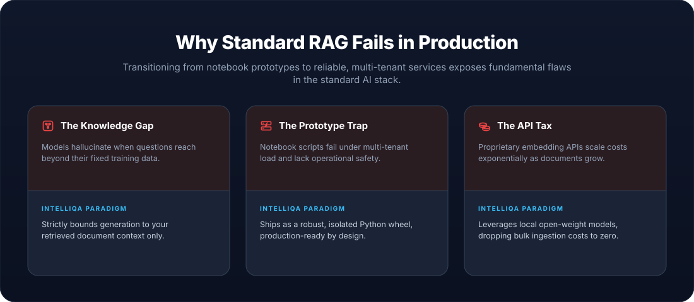
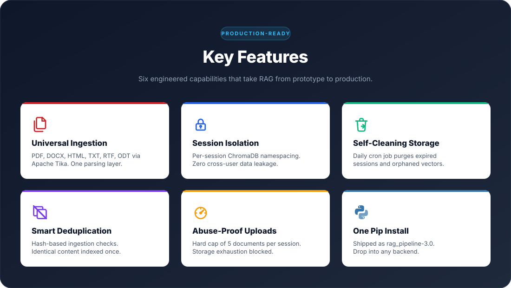
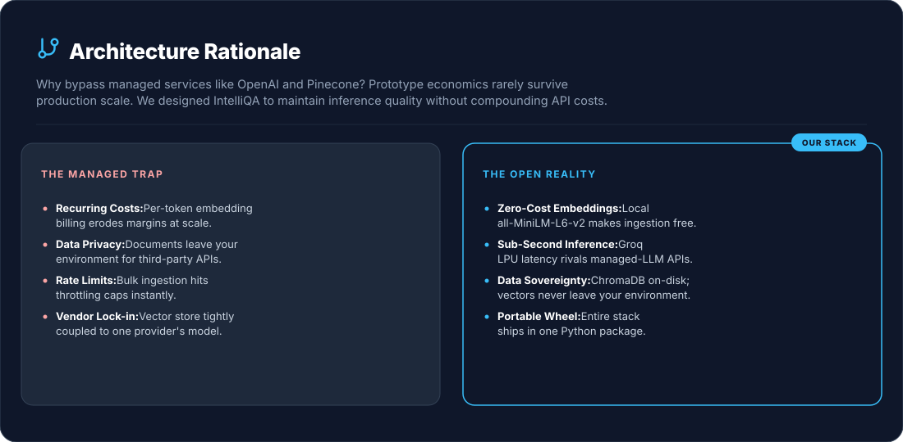

# IntelliQA: Document-Grounded RAG System

<p align="center">
  <a href="https://theanalyticmind.com/projects/IntelliQA/">
    
  </a>
</p>

## System Overview

IntelliQA is a **production-oriented Retrieval Augmented Generation (RAG) backend** for grounded question answering over private documents. Core logic ships as a Python wheel so the same package can power a notebook demo today and an API service tomorrow without rewrites.

> The driving question: **how do you make LLM answers reliable, multi-tenant, and operationally sustainable on private documents?**

## Problem Statement

<p align="center">
  
</p>

## TL;DR

IntelliQA is a packaged RAG backend that directly addresses each of the failure modes above. Sessions are **isolated** (no cross-user leakage), capped at **5 uploads** (abuse prevention), content is **deduplicated** at ingestion, and a **scheduled cron job** manages disk space. Generation runs on **Llama 3.3 70B via Groq** against a persistent **ChromaDB** store. Shipped as the `rag_pipeline` Python wheel and powering the live demo at [theanalyticmind.com/projects/IntelliQA](https://theanalyticmind.com/projects/IntelliQA/).

## 🛠️ Tech Stack

| **LLM & Inference** |   |
| --- | --- |
| **Embeddings** |   |
| **RAG Framework** |   |
| **Document Parsing** |  |
| **Deployment** |   |
| **Packaging** |  |
| **Programming Language** |   |

## ✨ Key Features

<p align="center">
  
</p>

## 🧠 System Design Philosophy

**1. Grounded Generation.** LLM runs at `temperature=0` and answers only from retrieved chunks. No speculation.

**2. Multi-Tenant Isolation.** Documents and queries are namespaced per session. Each user retrieves only from their own uploads.

**3. Operational Discipline.** Upload quotas, scheduled cleanup, and deduplication are first-class features, not afterthoughts.

**4. Package-First Distribution.** Core RAG logic ships as a Python wheel. The notebook is a demo. The wheel is the product, and it powers the live portfolio site.

**5. Honest Boundaries.** The system can fail in known ways (retrieval misses, ambiguous source documents, questions outside the indexed content). Design decisions surface these failure modes rather than hide them. `temperature=0` is for reproducibility, not zero-hallucination; the prompt instructs the model to say "I don't know" when context is insufficient.

## 🏗️ High-Level Architecture

The system is organized into four layers:

**Ingestion** &nbsp;·&nbsp; Apache Tika parses multi-format input; deduplication and chunking happen before vectors touch the store.

**Storage** &nbsp;·&nbsp; ChromaDB persists 384-dimensional vectors from `all-MiniLM-L6-v2`, namespaced by session.

**Generation** &nbsp;·&nbsp; Llama 3.3 70B Versatile (served on Groq LPU) generates answers bounded to retrieved context.

**Operations** &nbsp;·&nbsp; Session lifecycle, per-session upload quotas, and a daily cron job for cleanup.


## 🧠 Design Decision: Open Stack Over Managed APIs

<p align="center">
  
</p>

## 🛠️ Challenges & Lessons Learned

A few real engineering hurdles surfaced during the IntelliQA build that shaped the current architecture.

### 1. Apache Tika JVM warm-up cost

Tika runs on the JVM, and spawning a fresh JVM per request added unacceptable cold-start latency to the first document upload of a session. The fix was to keep a long-lived Tika server process running on the EC2 instance and proxy parsing requests to it, reducing per-request parse latency from several seconds to milliseconds. This pattern is worth knowing about: Tika is fast once warm and slow if you treat it like a CLI tool.

---

### 2. Disk pressure on shared EC2

The same EC2 instance hosts both the portfolio site and IntelliQA. Without active management, ChromaDB's persistent store would grow unbounded as users uploaded documents, and Tika's temp directory would accumulate orphaned files. This pressure directly motivated the cron-based cleanup design rather than relying on hosted/managed storage. Lesson: when infrastructure is shared, lifecycle management has to be designed in, not added later.

---

### 3. Embedding model trade-off

`all-MiniLM-L6-v2` (384 dimensions) was chosen over larger models (e.g., `bge-large-en` at 1024 dims) despite slightly lower retrieval quality. The trade-off was deliberate: MiniLM runs comfortably on CPU, has no API cost, and produces a smaller vector store. Recall on most document Q&A tasks is "good enough" without GPU embeddings. Worth revisiting if evaluation metrics show weakness.

---

### 4. Hallucination outside retrieved context

Even at `temperature=0`, the LLM would occasionally answer questions from its training data when retrieved chunks were thin or off-topic. Refining the system prompt to explicitly instruct  
<span style="color:#ff7f50;">
answer only from the provided context; if the context does not contain the answer, say so
</span>  
reduced this behavior significantly. This is the practical experience behind the "Honest Boundaries" principle in the design philosophy.


## 🧩 System Components

| Component | Engine / Module | Function |
| --- | --- | --- |
| **Document Parser** | Apache Tika | Extracts text from PDF, DOCX, HTML, TXT, RTF, ODT, and dozens of additional formats |
| **Ingestion Pipeline** | `rag_pipeline.utils` | Parsing, chunking, deduplication, metadata extraction |
| **Session Manager** | `rag_pipeline` (custom logic) | Namespaces documents by session, enforces 5-file upload quota |
| **Vector Store** | ChromaDB | Cosine similarity search over 384-dim embeddings, disk-persisted |
| **Query Engine** | `rag_pipeline.query_engine` | Embeds questions, retrieves top-K chunks, orchestrates generation |
| **System Prompt** | `rag_pipeline.query_engine` | Constrains LLM to retrieved context, instructs graceful "I don't know" behavior |
| **LLM Layer** | Llama 3.3 70B (Groq LPU) | Deterministic, grounded generation at `temperature=0` |
| **Storage Manager** | Cron + cleanup scripts | Daily removal of expired sessions, orphaned vectors, temp files |
| **Infrastructure** | Docker + AWS EC2 | Reproducible runtime, cloud deployment |

## 🚀 Installation & Usage

### Option 1: Install the Prebuilt Wheel
*Use this if you want IntelliQA as a ready-to-use RAG backend in your own application.* This is the path used by the live portfolio site.

```bash
git clone https://github.com/abhijitdeshpande83/GenAI.git
cd GenAI/IntelliQA
pip install dist/rag_pipeline-3.0-py3-none-any.whl
export GROQ_API_KEY="your-key-here"
```

Import and use anywhere:

```python
from rag_pipeline import query_engine, vector_store, utils
# See IntelliQA.ipynb for end-to-end usage examples
```

### Option 2: Install from Source
*Use this if you want to read, modify, or extend the core RAG logic.* The editable install (`pip install -e .`) picks up source changes immediately without reinstalling.

```bash
git clone https://github.com/abhijitdeshpande83/GenAI.git
cd GenAI/IntelliQA

python -m venv venv
source venv/bin/activate              # Windows: venv\Scripts\activate

pip install -r requirements.txt
pip install -e .

export GROQ_API_KEY="your-key-here"
jupyter notebook IntelliQA.ipynb
```

## 🚧 Current Status

|  |  |
| --- | --- |
| **Shipped** | Core pipeline, session isolation, upload quota, scheduled cleanup, AWS EC2 deployment, `rag_pipeline-3.0` wheel |
| **In progress** | RAG evaluation framework (see below) |

## 📏 Evaluation Approach

The in-progress evaluation framework is being built around four RAG-specific metrics rather than generic LLM benchmarks:

- **Faithfulness** &nbsp;·&nbsp; Does the generated answer follow from the retrieved chunks, or does the model introduce unsupported claims?
- **Answer Relevance** &nbsp;·&nbsp; Does the response actually address the question that was asked?
- **Context Precision** &nbsp;·&nbsp; Of the chunks retrieved, what fraction are actually relevant to the question?
- **Context Recall** &nbsp;·&nbsp; Of the chunks that *should* have been retrieved for a question, how many were?

A held-out evaluation set is being assembled from public RAG benchmarks (covering general knowledge documents) plus synthetic question-answer pairs generated against sample uploads. Once the harness is wired up, results will be tracked over time to catch regressions when components change (different chunk sizes, alternative embedding models, or future reranking experiments).

## 🚫 Out of Scope

A few capabilities are explicitly **not** part of IntelliQA's design. These are deliberate non-goals, not gaps:

- **User authentication.** Sessions are isolated by ID; authentication and user-account management are the responsibility of the calling application. IntelliQA is a backend, not a SaaS product.
- **Long-term knowledge accumulation.** Each session is ephemeral. IntelliQA does not build a persistent knowledge base across users or across time. Documents are scoped to the session that uploaded them and are subject to scheduled cleanup.
- **Per-document-type custom chunking.** All documents are split using recursive character splitting with consistent parameters. Format-aware chunking (e.g., respecting code blocks in markdown or tables in PDFs) is not implemented.
- **Document editing or partial updates.** Modifying an indexed document requires re-uploading it. There is no in-place edit path.

## 🚀 Future Improvements

- Cross-encoder reranking on retrieved chunks
- Inline citations linking answers back to source chunks
- Hybrid retrieval (BM25 + dense vector)
- Streaming responses for lower perceived latency
- Pluggable embedding models for users who want to swap MiniLM for a larger model

## 💡 System Value

IntelliQA shows that a RAG backend can be **grounded, multi-tenant, operationally sound, and portable** without depending on managed APIs. The production discipline (session isolation, upload quotas, scheduled cleanup, deduplication) is built into the package, not bolted on later.

> Production-grade RAG, distributed as a wheel, powering a live portfolio site today.