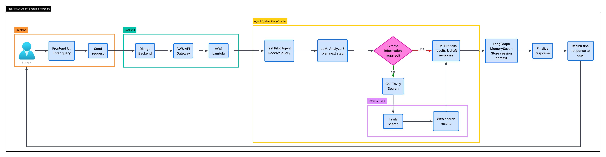

# Autonomous Agent -- TaskPilot 🚀

**TaskPilot** is a LangGraph-powered autonomous AI agent that performs
real-time web research using Groq LLM and Tavily search.

------------------------------------------------------------------------

## Scope

Build a lightweight AI agent capable of performing **real-time web
research** while maintaining **session-based conversational context**.\
The agent uses **LangGraph orchestration** to dynamically decide when to
respond directly and when to invoke external tools.

------------------------------------------------------------------------

## Business Value

-   Demonstrates **tool-augmented LLM reasoning**
-   Enables **real-time knowledge retrieval**
-   Provides a **modular agent architecture**
-   Supports **serverless deployment** for scalable usage

------------------------------------------------------------------------

## 🛠 Tech Stack

<table>
  <tr>
    <td><strong>Agent Framework</strong></td>
    <td>
      
    </td>
  </tr>

  <tr>
    <td><strong>LLM Inference</strong></td>
    <td>
      
    </td>
  </tr>

  <tr>
    <td><strong>External Tools</strong></td>
    <td>
      
    </td>
  </tr>

  <tr>
    <td><strong>Memory / State</strong></td>
    <td>
      
    </td>
  </tr>

  <tr>
    <td><strong>Cloud / Deployment</strong></td>
    <td>
      
      
      
    </td>
  </tr>

  <tr>
    <td><strong>Programming Language</strong></td>
    <td>
      
    </td>
  </tr>
</table>

------------------------------------------------------------------------

## Architecture

------------------------------------------------------------------------

## Implementation

-   Built an **agentic workflow using LangGraph** for reasoning and tool
    orchestration.
-   Integrated **Groq LLM** for fast, low-latency inference.
-   Added **Tavily Search** for real-time web information retrieval.
-   Implemented **MemorySaver checkpointing** for session-based memory.
-   Organized code into **modular components** for agent logic and
    tools.
-   Containerized the project using **Docker**.
-   Added **AWS Lambda Function** with JSON parsing and CORS support for
    API Gateway.

------------------------------------------------------------------------

## Challenges

- **CORS with API Gateway:** Direct frontend requests to API Gateway failed due to CORS restrictions. The solution was to route requests through the **Django backend**, which calls the Lambda endpoint and returns the response to the frontend.

- **Agent Workflow Structure:** Understanding how to **separate agent definition from execution** in LangGraph and invoking it through a `run_agent` function required careful design initially.

------------------------------------------------------------------------

## Outcome

A lightweight LangGraph-based agent capable of **real-time web research,
tool usage, and contextual conversations**, deployable locally or in
serverless environments.
